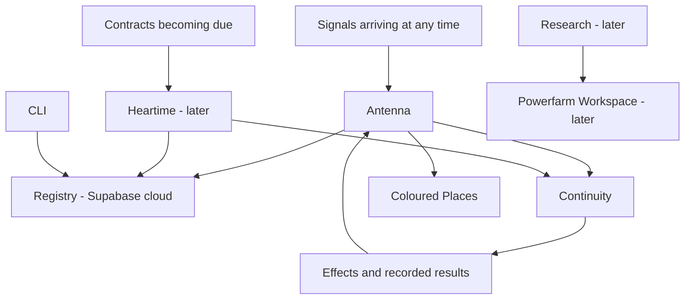

# Powerfarm — responsibilities and current registration

Operator decision, 2026-09-15. This document records the current arrangement;
it does not declare future organs implemented.

**Powerfarm learns, runs, and remembers:** Research, Continuity, Registry.

| Organ | Responsibility | Current boundary |
| --- | --- | --- |
| Research | Learn and produce research that informs work | Later; work will happen in Powerfarm Workspace |
| Continuity | Compile and execute graphs, preserve execution continuity | New supplied v2 source in `powerfarm-continuity`; Antenna still runs the existing LangGraph adapter |
| Registry | Remember identities, exact versions, authority, contracts and placements | Supabase cloud; source retained in `powerfarm-identity` |
| Antenna | Receive signals at any time, check authority, admit and route work/results | Running on lab-8gb; contracts are checked against Registry |
| Heartime | Send due contracts to execution after checking Registry | `powerfarm-heartime` deliberately has no commits or implementation |
| CLI | Instantiate templates, register entities, accept contracts and inspect work | `powerfarm-cli` |
| Coloured Places | Present observations and their freshness to the operator | App Park tenant; observability contract with Antenna |
| Workspace | Place where research and software work happen | Later; no new workspace runtime created here |

## Parks on lab-8gb

- `pf.app-park.8gb`: `/Users/danvoulez/App Park`.
- `pf.engine-park.8gb`: `/Users/danvoulez/Engine Park`.

A Park is a physical folder and a registered place. Admission grants a tenant
the applicable institutional services: Powerfarm identity, the shared login,
and explicit service contracts. Copying arbitrary bytes into the directory is
not a substitute for issuing the contract. A new tenant is admitted through
Registry first; its actual bytes, source revision and deployment are then
recorded against that identity and place.

Coloured Places uses app contract v2 and remains at
`/Users/danvoulez/App Park/coloured-places`. Its human login uses the existing
Powerfarm Identity issuer; its machine credential belongs to
`pf.coloured-places`. These are separate identities and authorities.

Observability belongs to Antenna. Scheduled observation would require Heartime
to trigger an authorized observation workflow in the future. Heartime is not
NTP and is not an alternative telemetry receiver. The app must preserve
Unknown/Stale when observation is missing; missing evidence does not prove
that a place is offline.

## Repository boundaries

All repositories are in the `powerfarm` GitHub organization. Antenna's current
name is `powerfarm-antenna`. Registry source currently lives in
`powerfarm-identity`; its database remains in Supabase cloud. Do not recreate
the removed Registry repository as another source of authority.

`powerfarm-platform` and `powerfarm-process-manager` are retained unchanged.
Research and Workspace are future work. Heartime stays empty; this document
holds its responsibility until implementation is explicitly started.
